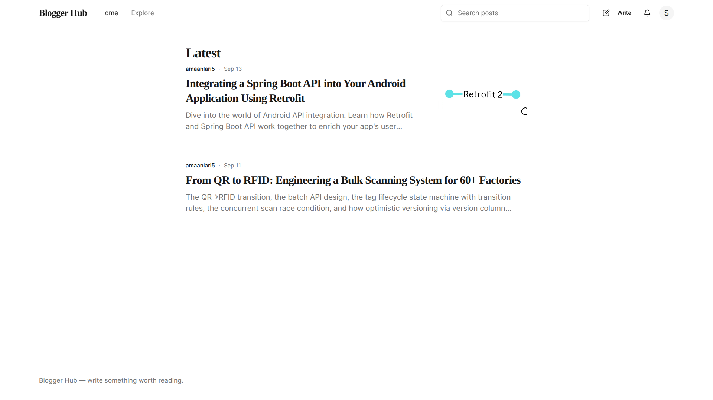
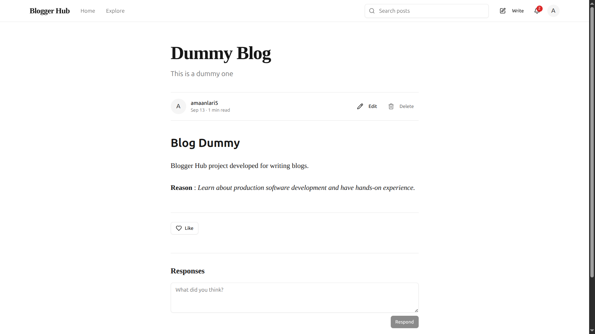
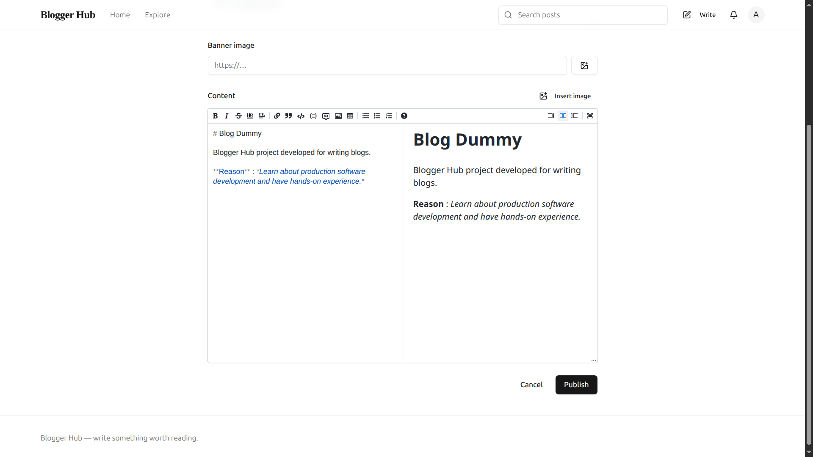
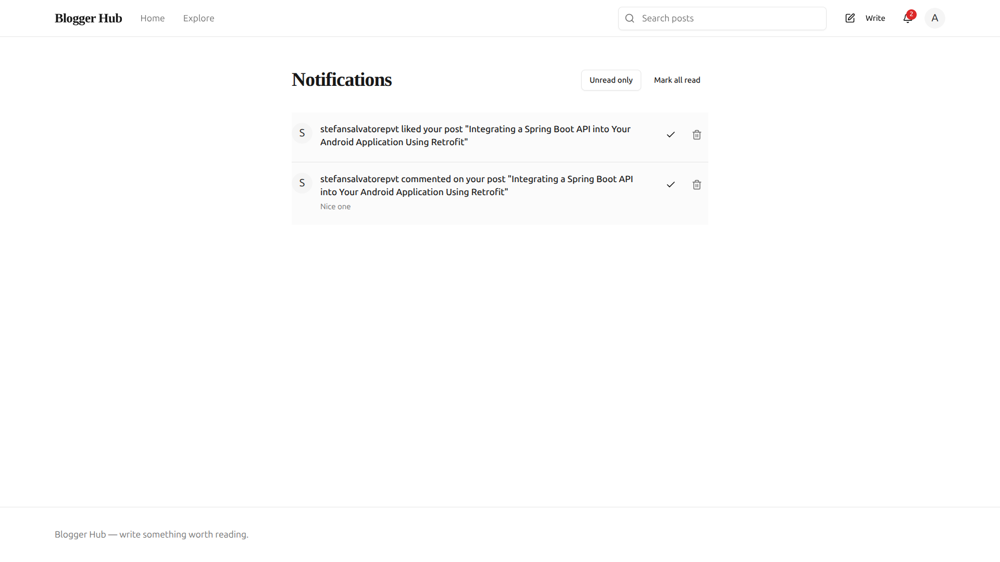
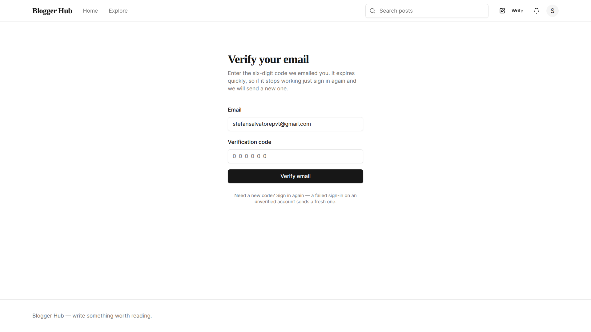
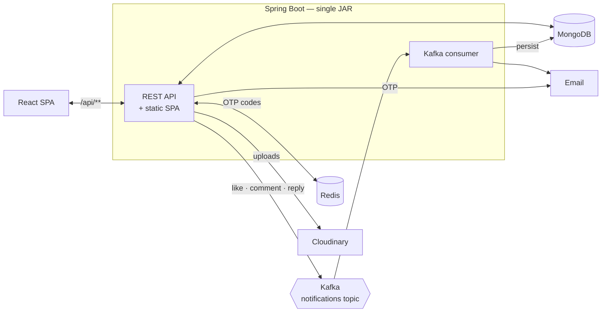

# Blogger Hub

**Full-stack blogging platform — actively developed.** Spring Boot backend, React + TypeScript
frontend, JWT auth with email OTP verification, role-based access control, Kafka-driven
notifications, Redis-backed OTP storage, MongoDB persistence, and a single-artifact cloud deploy.

<p>
  
  
  
  
  
  
  
  
  
  
  
  
  
</p>

---

## Live demo

| | URL | What is deployed |
| --- | --- | --- |
| **Render** | **https://blogger-hub.amaanlari.me** | The full stack as one Docker service — the Spring Boot API with the React SPA served from the same JAR, so the frontend is same-origin with the API. |
| **Vercel** | **https://blogger-hub-lari.vercel.app** | The React SPA on its own, built from `frontend/` and pointed at the Render backend via `VITE_API_BASE_URL`. |

Backing services are managed: MongoDB Atlas, Redis Cloud, Aiven Kafka (SASL_SSL / SCRAM-SHA-256)
and Cloudinary. The Render service is defined by the committed [`render.yaml`](render.yaml)
blueprint.

> The Render deployment is the reference one. The Vercel SPA talks to the same backend
> cross-origin, which currently exercises a CORS gap — see [Planned / roadmap](#planned--roadmap).

### Screenshots

**Feed** — public, paginated, newest-first, with search in the header.



**Post** — rendered markdown with author byline, reading time, owner-only edit/delete, like button
and the responses thread.



**Editor** — split markdown editor with live preview, a banner image field and inline image
insertion, both uploading to Cloudinary.



**Notifications** — like and comment events delivered through Kafka, with an unread-only filter,
per-row mark-read/delete and an unread badge in the header.



**Email verification** — the six-digit OTP held in Redis under a TTL.



---

## Overview

Blogger Hub is a Medium-style publishing app: readers browse and search a public feed without an
account, and signed-in authors write posts in a markdown editor, upload images, and get notified
when someone likes or comments on their work. The backend is a Spring Boot monolith exposing a
JSON API over MongoDB, with Kafka carrying notification events out of the request path and Redis
holding short-lived email verification codes. The React SPA is compiled by Maven and packaged into
the same executable JAR as the API, so the whole product ships as one artifact — though it can also
be deployed standalone against a remote backend, which is what the Vercel demo does.

It is built as a portfolio-grade reference for a realistic service: real auth, real authorization,
real async messaging, real media handling — not a CRUD demo.

---

## Currently available features

Everything below is implemented in the committed code and reachable end-to-end from the UI, unless
explicitly marked **API only**.

### Authentication & accounts
- **Signup** with username/email/password; passwords hashed with BCrypt, uniqueness enforced on
  both username and email.
- **Email OTP verification** — a 6-digit code stored in Redis under a per-email key with a TTL, and
  emailed on signup. `POST /api/auth/verify-otp` validates it. Login is gated on verification; an
  attempted login by an unverified account is rejected *and* triggers a fresh code, which is the
  current resend path.
- **JWT access + refresh tokens.** Access tokens are short-lived and stateless; refresh tokens are
  persisted as MongoDB documents so they can be revoked. Refresh rotates the token (old one deleted,
  new one issued).
- **Logout** (revokes one refresh token) and **logout-all** (revokes every session for the user).
- **Protected client routes** — the SPA bootstraps auth from stored tokens and guards the editor,
  settings and notifications routes.

### Authorization (RBAC)
- Three roles — `FREE_USER`, `PREMIUM_USER`, `ADMIN_USER` — enforced with Spring Security method
  security (`@EnableMethodSecurity` + `@PreAuthorize`) rather than URL patterns alone.
- Admin-only user listing endpoints, premium-only post flagging, and self-only reads on
  `GET /api/users/id/{userId}`.
- A deliberately small public surface: the paginated feed and single-user profile lookup are
  anonymous, everything else under `/api/**` requires a valid access token.

### Blog posts
- **Create / edit / delete** posts, with ownership checks on the server.
- **Markdown editor** (`@uiw/react-md-editor`) with live preview, plus a markdown normaliser that
  repairs malformed input before it is persisted.
- **Markdown rendering** with GitHub-flavoured markdown and syntax-highlighted code blocks.
- **Paginated, newest-first feed** with case-insensitive search across title and description —
  public, so anonymous visitors can browse before signing up.
- **Per-author post listings** on profile pages.
- **Premium posts** — a `PREMIUM_USER`-gated flag that changes how post content is served.

### Interactions
- **Likes** — like/unlike a post, list every post the signed-in user has liked, list the users who
  liked a given post.
- **Comments** — add, delete, and **reply**. Replies carry a `parent_id`; the SPA reconstructs the
  thread client-side.

### Notifications
- **Kafka-backed pipeline.** Likes, comments and replies publish a `NotificationEvent` to a Kafka
  topic keyed by recipient. A `@KafkaListener` consumer (concurrency 3) persists the notification
  to MongoDB and, if the recipient has email notifications enabled, sends an email — so none of
  that work happens inside the HTTP request.
- **Self-notification suppression** — the producer drops events where actor == recipient.
- **Notifications UI** — paginated list, unread-only filter, unread badge in the header, mark one
  read, mark all read, delete.

### Media
- **Cloudinary uploads** with server-side content-type allow-listing (JPEG, PNG, GIF, WebP, AVIF)
  and a 5 MB per-file limit.
- **Post banner images** and **inline images embedded into markdown** from the editor.
- **Profile picture** upload and removal, with a cache-busting URL helper because avatars overwrite
  a fixed Cloudinary public ID.

### Profiles
- Public profile pages by username with the author's posts.
- Settings page: edit bio, change/remove avatar, sign out.

### Platform
- **Single-artifact packaging** — `frontend-maven-plugin` downloads a pinned Node/npm, runs
  `npm ci && npm run build`, and drops the Vite output straight into the Spring Boot classpath.
  One `mvn package` produces one JAR containing API + SPA.
- **SPA deep-link fallback** (`SpaFallbackController`) so `/posts/{id}` survives a hard refresh
  while `/api/**` still returns a real 404.
- **Global response envelope and exception handling** via `ResponseBodyAdvice` +
  `@RestControllerAdvice`.
- **Actuator health endpoint**, used as the Render health check.
- **Local infra via Docker Compose** — MongoDB, Redis, and Kafka in KRaft mode with automatic topic
  creation — plus a `run-local.sh` one-command runner.

### Implemented API-only (no UI yet)
- **Block / unblock users** — `POST/DELETE/GET /api/block/**` with blocked-user listing and a
  block-status check. Fully implemented server-side; nothing in the React app calls it yet.
- **Admin user listings** — `GET /api/users/all` and `/api/users/all-users-details`.

---

## Planned / roadmap

Active development, roughly in priority order.

- **Follow / unfollow users.** Not started. The `NEW_FOLLOWER` notification type and its email
  template already exist as scaffolding, but there is no follow model, repository, or endpoint yet.
  Landing this also unlocks a personalised "following" feed.
- **Block UI.** Wire the existing block API into profile pages and filter blocked users out of the
  feed, comments and notifications.
- **Dedicated resend-OTP endpoint.** Today a new code is only sent as a side effect of a failed
  login on an unverified account; this should be an explicit endpoint with its own rate limit.
- **Return the created post's ID from `POST /api/blogposts`.** The endpoint currently answers with a
  bare success message, so the editor has to re-list the author's posts to find what it just wrote.
- **Broader test coverage.** Repository and Redis tests exist; controller, service and JWT test
  packages are still empty. Target: `@WebMvcTest` slices for the auth/blog/notification controllers
  and Testcontainers for Mongo and Kafka.
- **Real Redis caching.** Redis is currently an OTP store only. The feed, per-author listings and
  unread counts are the obvious first read-through caches.
- **Add `PATCH` to the CORS allow-list.** `SecurityConfig.corsConfigurationSource()` permits
  `GET, POST, PUT, DELETE, OPTIONS` only, so browser preflights fail for the four `PATCH` endpoints
  (mark notification read, mark all read, profile partial update, premium toggle). Invisible on the
  Render deployment, which is same-origin, but live on the cross-origin Vercel SPA.
- **A dedicated API reference doc.** [`docs/API_CONTRACT.md`](docs/API_CONTRACT.md) is currently the
  contract — exhaustive and accurate, but written as an integration brief rather than a reference.
  Plan: a trimmed `docs/API.md` grouped by resource, and an OpenAPI spec to generate it from.
  (`SecurityConfig` still whitelists Swagger paths from an earlier iteration; no OpenAPI dependency
  is actually wired up.)
- **Post drafts, tags, and reading time.**

---

## Architecture

One Spring Boot application serves the API and the compiled React SPA from a single JAR. MongoDB is
the primary store, Redis holds expiring OTP codes, and notification work is pushed onto a Kafka
topic so it never runs inside a user's request.



### MongoDB as the primary store

Posts, comments and notifications are documents of genuinely different shapes, almost always read
whole rather than joined. A post embeds a `BlogUserRef` author snapshot; a notification embeds the
actor's username, avatar and the target's title, so rendering the notification list needs no
follow-up lookups. The schema also moved a lot during development, and a document store absorbed
those changes without migrations. Indexes are declared on the documents themselves
(`auto-index-creation: true`).

### Redis for expiring state

OTP codes are the one piece of state here that *should* delete itself. Redis makes expiry a
property of the key, so an unused code simply stops existing — no TTL column, no sweeper job, no
stale code lingering in the users collection. It also keeps a high-churn, write-once-read-once
workload off the primary datastore. Redis is not used as a cache today; that is on the roadmap.

### Kafka for notification fan-out

A like or a comment should return as soon as it is written, not after a notification document is
inserted and an email is handed to an SMTP server. Publishing an event decouples the two: the write
path produces once and returns, and the consumer does the slow work. Events are keyed by recipient,
so one user's notifications land on one partition and stay ordered while three consumer threads
work on different users. The topic is also a durable log — if the consumer throws or is down,
events are retained and replayed from the committed offset instead of being lost, which an
in-process `@Async` executor cannot offer.

### A single deployable

This is a monolith by choice, not as a staging post to microservices. One application, one
datastore, one release — splitting it would buy independent deployability that nothing here needs
and cost distributed transactions, cross-service auth, and several times the local-dev setup, for a
product that fits comfortably on a 512 MB instance. Internally it is still organised by feature
(`auth`, `blogpost`, `notification`, `media`, `interactions`), each with its own controller, service
and repository, which is where the real maintainability comes from. Bundling the SPA into the same
JAR is the same trade: one artifact, one origin, and CORS stops being a problem.

Scale, if it is ever needed, comes from running more instances of this one application behind a load
balancer — the app is stateless, sessions live in JWTs, and Kafka consumer groups split the
notification workload across instances automatically.

---

## Tech stack

### Backend
| | |
| --- | --- |
| Language | Java 21 |
| Framework | Spring Boot 3.3.5 (Web, Validation, Actuator) |
| Security | Spring Security, method security, custom JWT filter, BCrypt |
| Tokens | `com.auth0:java-jwt` 4.4.0 |
| Data | Spring Data MongoDB, Spring Data Redis |
| Messaging | Spring for Apache Kafka |
| Mail | Spring Mail (SMTP) + Google Gmail API client |
| Media | Cloudinary SDK (`cloudinary-http5`) |
| Build | Maven (wrapper committed) |

### Frontend
| | |
| --- | --- |
| Framework | React 18 + TypeScript (strict) |
| Build | Vite 6 |
| Routing | React Router v6 (lazy-loaded routes) |
| Server state | TanStack Query v5 |
| Client state | Zustand |
| Styling | Tailwind CSS 3.4 + shadcn/ui (Radix primitives) |
| Forms | React Hook Form + Zod |
| HTTP | Axios |
| Markdown | `@uiw/react-md-editor`, `react-markdown` + `remark-gfm`, `react-syntax-highlighter` |
| Icons | lucide-react |
| Tests | Vitest + Testing Library + jsdom |

### Infrastructure
| | |
| --- | --- |
| Primary store | MongoDB (local Docker / MongoDB Atlas) |
| Ephemeral store | Redis (local Docker / Redis Cloud) |
| Event bus | Apache Kafka — KRaft locally, Aiven (SASL_SSL, SCRAM-SHA-256) in the cloud |
| Object storage | Cloudinary |
| Email | SMTP (Gmail) / Gmail API |

### DevOps
| | |
| --- | --- |
| Containers | Multi-stage Dockerfile (Temurin 21 JDK build → JRE runtime, non-root user) |
| Local orchestration | Docker Compose (Mongo, Redis, Kafka + topic bootstrap) |
| Local runner | `run-local.sh` — infra up, build, run, with generated-and-persisted dev secrets |
| Deployment | Render blueprint (`render.yaml`), Docker runtime, `/actuator/health` health check |
| Config | Spring profiles (`dev`, `dev-container`, `staging`, `prod`), fully env-var driven |

---

## Getting started

### Prerequisites

| Tool | Version | Notes |
| --- | --- | --- |
| JDK | 21 | `java.version` in `pom.xml` |
| Docker + Compose | any recent | For MongoDB, Redis and Kafka |
| Node.js | ≥ 22.13.1 | Only for frontend hot-reload — `mvn package` downloads its own pinned Node (v22.13.1 / npm 10.9.2) into `frontend/node/` |
| Cloudinary account | — | Optional locally; uploads no-op without credentials |
| SMTP or Gmail API credentials | — | Optional locally; OTP emails no-op without them |

### Fastest path — `run-local.sh`

```bash
git clone https://github.com/amaanlari/blogger-hub.git
cd blogger-hub
./run-local.sh
```

This starts MongoDB, Redis and Kafka via Docker Compose, creates the notifications topic, generates
and persists dev JWT secrets, builds backend + frontend into one JAR, and runs it on
**http://localhost:8080**.

```bash
./run-local.sh --dev           # backend via mvn spring-boot:run + Vite dev server, both hot-reloading
./run-local.sh --skip-build    # run the existing target/*.jar
./run-local.sh --stop          # tear the infra containers down
```

Export real `CLOUDINARY_*` / `MAIL_*` / `GMAIL_*` values before running to use them; the script only
fills in dummy defaults for variables you have not already exported.

### Manual setup

**1. Start the backing services**

```bash
docker compose up -d mongodb redis kafka kafka-init
```

Compose maps MongoDB to `localhost:27018`, Redis to `localhost:6380`, and Kafka to
`localhost:9092`.

**2. Configure the app**

`src/main/resources/application.yaml` reads everything from environment variables and holds no
secrets. Copy `application-example.yaml` as a reference and either export the variables or create a
profile file (`application-dev.yaml`, git-ignored):

| Variable | Purpose |
| --- | --- |
| `MONGODB_URI`, `MONGODB_DATABASE` | MongoDB connection |
| `REDIS_HOST`, `REDIS_PORT`, `REDIS_USERNAME`, `REDIS_PASSWORD` | Redis connection |
| `KAFKA_BOOTSTRAP_SERVERS`, `KAFKA_TOPIC_NOTIFICATIONS`, `KAFKA_CONSUMER_GROUP_ID` | Kafka |
| `KAFKA_SSL_TRUSTSTORE_PATH`, `AIVEN_KAFKA_PASSWORD` | Kafka SASL_SSL — cloud only |
| `ACCESS_TOKEN_SECRET`, `REFRESH_TOKEN_SECRET` | JWT signing |
| `ACCESS_TOKEN_EXPIRATION_MINUTES`, `REFRESH_TOKEN_EXPIRATION_DAYS` | Token lifetimes |
| `OTP_TTL` | OTP lifetime, in minutes |
| `CLOUDINARY_CLOUD_NAME`, `CLOUDINARY_API_KEY`, `CLOUDINARY_API_SECRET`, `CLOUDINARY_DEFAULT_PROFILE_PIC` | Media |
| `MAIL_HOST`, `MAIL_PORT`, `MAIL_USERNAME`, `MAIL_PASSWORD` | SMTP |
| `GMAIL_CLIENT_ID`, `GMAIL_CLIENT_SECRET`, `GMAIL_REFRESH_TOKEN` | Gmail API |
| `PORT` | HTTP port (default `8080`) |

> The base `application.yaml` enables Redis TLS and Kafka `SASL_SSL`, which suits the managed
> cloud services but not plain local containers. `run-local.sh` handles that override for you; if
> you are wiring it up by hand, point a profile file at plaintext local brokers.

**3. Build and run**

```bash
./mvnw clean package                        # builds the React SPA and bundles it into the JAR
./mvnw spring-boot:run -Dspring-boot.run.profiles=dev
```

Backend-only iteration, skipping the frontend build entirely:

```bash
./mvnw clean package -DskipFrontend=true
```

**4. Frontend with hot reload**

```bash
cd frontend
npm install
npm run dev          # http://localhost:5173
```

Open **:5173**, not :8080 — Vite proxies `/api` to the backend, which keeps every call same-origin.
Other scripts: `npm run build`, `npm run lint` (`tsc --noEmit`), `npm test` (Vitest).

### Docker

The full stack, app included:

```bash
ACTIVE_PROFILE=dev-container docker compose up --build
```

The multi-stage `Dockerfile` builds the fat JAR (Java + React) on Temurin 21 JDK and runs it on a
JRE image as a non-root `spring` user, with `MaxRAMPercentage` sizing instead of a fixed heap.

### Deploying to Render

`render.yaml` is a ready-to-use blueprint: Docker runtime, `staging` profile, `/actuator/health`
health check, and every backing service external (Atlas, Redis Cloud, Aiven Kafka, Cloudinary).
This is the full-stack deploy — one service serving both the API and the SPA. Full walkthrough in
[`docs/RENDER_DEPLOYMENT.md`](docs/RENDER_DEPLOYMENT.md).

### Deploying the SPA standalone (Vercel)

The frontend can also ship on its own, pointed at a remote backend. Root directory `frontend`,
build `npm run build`, output `../src/main/resources/static` (per `vite.config.ts`), and one
environment variable:

```
VITE_API_BASE_URL=https://<your-backend-host>/api
```

Leave it unset for the bundled deploy — the default `/api` is correct whenever the SPA and API are
same-origin. See [`frontend/.env.example`](frontend/.env.example). Note the outstanding `PATCH`
CORS gap above, which only affects this cross-origin setup.

---

## Project structure

```
blogger-hub/
├── src/main/java/com/lari/bloggerhub/
│   ├── BloggerHubApplication.java
│   ├── advice/            # Global response envelope + exception handler
│   ├── config/            # Security, Kafka, Redis, Cloudinary, Mail, Gmail
│   ├── constant/          # Shared constants and email templates
│   ├── controller/        # REST controllers, grouped by feature
│   │   ├── auth/  blogpost/  bloguser/  interactions/  media/
│   │   ├── notification/  block/
│   │   └── SpaFallbackController.java   # deep-link forwarding for the SPA
│   ├── document/          # MongoDB documents
│   ├── dto/               # request/ · response/ · event/ (Kafka payloads)
│   ├── enums/             # Role, AccountStatus, NotificationType
│   ├── exception/
│   ├── repository/        # Spring Data Mongo repositories
│   ├── response/          # DataResponse / SuccessResponse / ErrorResponse
│   ├── security/          # JwtFilter, AccessTokenEntryPoint
│   ├── service/           # Business logic, mirrors the controller grouping
│   │   └── notification/  # Kafka producer, consumer, NotificationService
│   └── util/jwt/          # JwtHelper
├── src/main/resources/
│   ├── application.yaml           # env-var driven base config
│   ├── application-example.yaml   # documented template
│   ├── application-{dev,dev-container,staging,prod}.yaml   # git-ignored
│   ├── templates/                 # email templates
│   └── static/                    # Vite build output — generated, never hand-edited
├── src/test/java/…                # JUnit tests
├── frontend/
│   ├── src/
│   │   ├── app/               # App shell, routes, providers
│   │   ├── features/          # auth · blogs · profile · notifications · home · explore
│   │   │   └── <feature>/{api,components,hooks,store,utils}
│   │   ├── shared/            # ui primitives, layout, http client, types, utils
│   │   └── test/
│   ├── vite.config.ts         # builds into ../src/main/resources/static
│   └── package.json
├── docs/
│   ├── API_CONTRACT.md        # source of truth for API integration
│   ├── FRONTEND.md            # frontend architecture and dev setup
│   ├── RENDER_DEPLOYMENT.md
│   └── media/                 # README screenshots
├── docker-compose.yaml        # Mongo · Redis · Kafka (KRaft) · topic bootstrap · app
├── Dockerfile                 # multi-stage: JDK build → JRE runtime
├── render.yaml                # Render blueprint
├── run-local.sh               # one-command local stack
├── pom.xml                    # backend + frontend build
└── LICENSE                    # MIT
```

---

## Documentation

| Document | What it covers |
| --- | --- |
| [`docs/API_CONTRACT.md`](docs/API_CONTRACT.md) | Every endpoint, request/response shape, auth rule and known quirk, written from the source. Read §0 before writing any client — responses are `snake_case` and wrapped by a global `ResponseBodyAdvice`. |
| [`docs/FRONTEND.md`](docs/FRONTEND.md) | SPA architecture, dev setup, the Maven/Vite integration, and the backend behaviour that shapes the client code. |
| [`docs/RENDER_DEPLOYMENT.md`](docs/RENDER_DEPLOYMENT.md) | Step-by-step Render deploy, including the two required secret files. |
| [`NOTIFICATION_SYSTEM_DOCUMENTATION.md`](NOTIFICATION_SYSTEM_DOCUMENTATION.md) | The Kafka event pipeline end to end. |
| [`DOCKER_KAFKA_SETUP.md`](DOCKER_KAFKA_SETUP.md) | Running Kafka in KRaft mode locally. |

---

## Contributing

Issues and pull requests are welcome.

1. Fork and branch: `git checkout -b feature/your-feature`
2. Keep the backend formatted in the existing google-java-format style; the frontend must pass
   `npm run lint` (strict `tsc`).
3. Run the tests: `./mvnw test` and `cd frontend && npm test`.
4. If you touch an endpoint, update [`docs/API_CONTRACT.md`](docs/API_CONTRACT.md) in the same PR.
5. Open a PR describing what changed and how you verified it.

---

## License

Released under the [MIT License](LICENSE).

---

## Contact

**Amaan Lari**

- Portfolio — [amaanlari.me](https://amaanlari.me)
- GitHub — [@amaanlari](https://github.com/amaanlari) · [blogger-hub](https://github.com/amaanlari/blogger-hub)
- LinkedIn — [amaanlari](https://linkedin.com/in/amaanlari)
- X — [@amaanlari_](https://x.com/amaanlari_)
